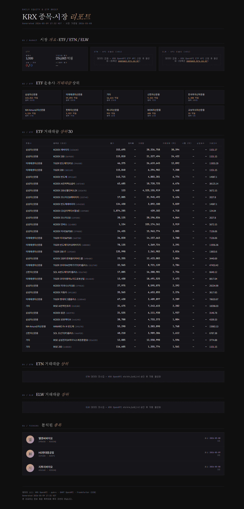
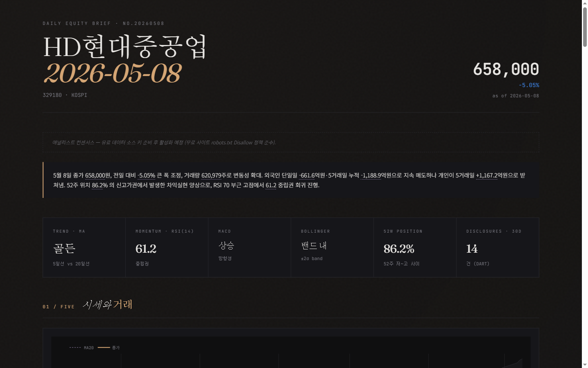
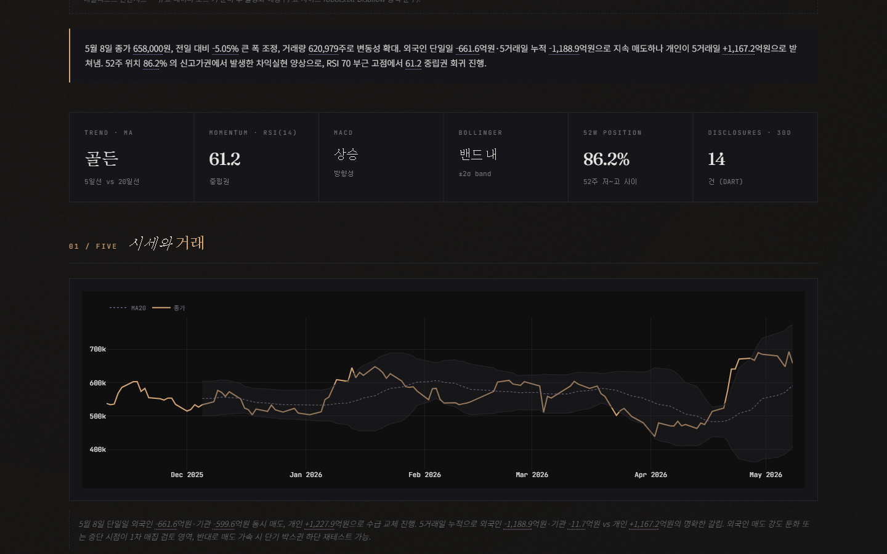
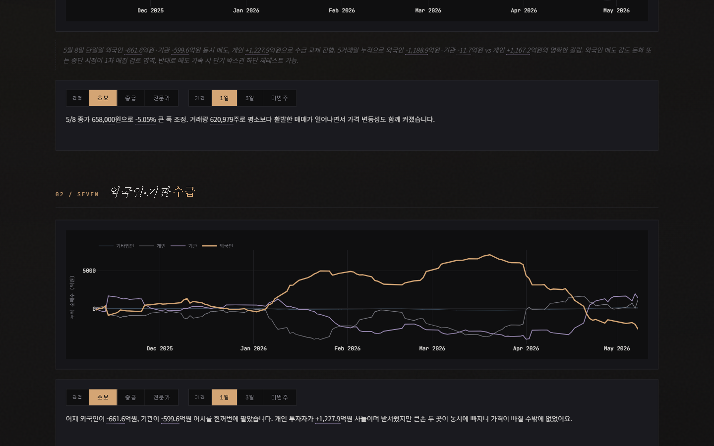
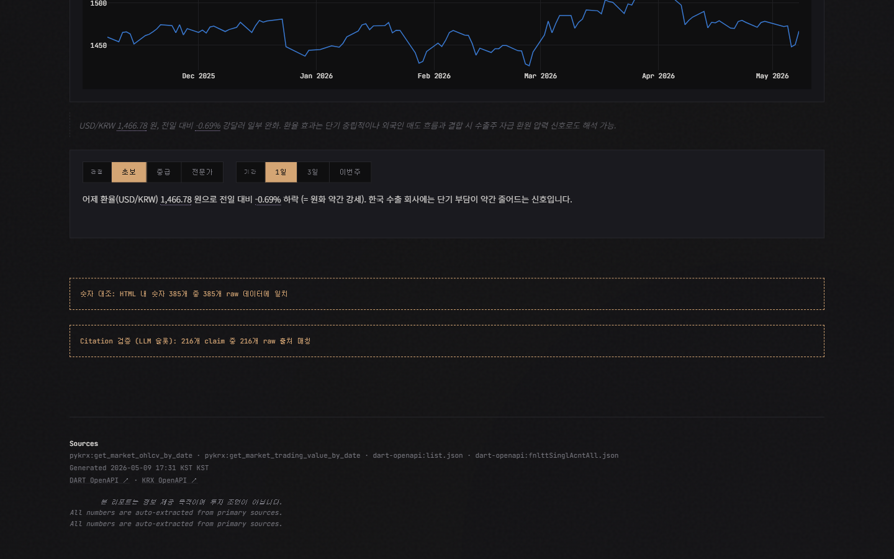

# 환각 없는 KRX 종목 리포트

> **한 줄 요약**: 명령어 한 줄로 KOSPI/KOSDAQ 임의 종목의 **하루치 분석 페이지**를 자동으로 만들어 주는 시스템입니다. **모든 숫자에 출처가 달려 있고**, AI가 쓴 코멘트조차 검증을 통과해야 페이지에 박힙니다.

🌐 **공개 페이지**: <https://bizsinsightclub.github.io/stockreport/>

---

## 어떤 모습인가요?

### 1) 첫 화면 — 시장 전체 한눈에

ETF / ETN / ELW 거래대금 상위와 최근 발행된 종목 리포트 목록이 한 페이지에 모입니다.



### 2) 종목 페이지 — 가격·시그널이 먼저 보입니다

종목명을 누르면 그날의 종가, 시그널 카드(골든/RSI/추세/52주 위치 등)가 가장 위에 뜹니다.



### 3) AI가 쓴 한 줄 요약 — **모든 수치에 출처가 박혀 있음**

“골든 + RSI 61.2 + 52주 위치 86.2%” 같은 숫자가 본문에 보이는데, 페이지 소스를 열어 보면 각 숫자에 `data-cite="파일:경로:값"` 속성이 달려 있습니다. 빌드할 때마다 이 출처를 raw 데이터와 자동 대조합니다.



### 4) 9가지 시각 — 입문 / 중급 / 전문 × 1일 / 3일 / 1주

같은 섹션을 9가지 방식으로 다시 풀어 봅니다. 비전공자에게는 비유로(“외국인이 사면 외국 큰손이 좋게 본다”), 분석가에게는 매매 시그널 어조로. 토글 버튼으로 즉시 전환됩니다.



### 5) 페이지 하단 — **검증 배지**

리포트 하단에 두 개의 배지가 항상 떠 있습니다.

- **숫자 대조** — HTML 본문에 보이는 모든 숫자가 raw JSON에 일치하는지
- **Citation 검증** — AI가 쓴 모든 numeric claim에 출처가 달려 있는지 + 그 출처가 실제 raw 값과 매칭되는지



> 이 두 배지가 모두 **pass**일 때만 “이 페이지의 숫자는 믿을 수 있다”라고 자신 있게 말할 수 있습니다. fail이면 빨간 배지로 즉시 보입니다 — *시스템이 거짓말을 못 하게 하는* 핵심 장치입니다.

---

## 왜 만들었나요?

시판 AI 챗봇에게 “삼성전자 어제 종가가 어땠어?”라고 물으면 그럴듯한 숫자를 자신감 있게 답하지만, 실제 KRX 데이터와 어긋나는 경우가 잦았습니다. **투자 판단을 보조한다는 자료가 잘못된 숫자를 자연어로 자신 있게 말하면 그건 정보가 아니라 위험**입니다.

그래서 만들었습니다.

> **환각(hallucination) 없는 분석 리포트를, API 키 없이도 일단 돌아가는 형태로, AI 어시스턴트와 협업해서.**

이 세 조건이 본 프로젝트의 DNA입니다.

---

## 어떻게 환각을 막나요? — 3중 안전장치

### ① 메타 트리플 (숫자 옆에 출처가 붙어 다닌다)

외부에서 데이터를 가져올 때마다 다음 4-tuple로 감싸서 디스크에 저장합니다.

```json
{
  "data":       { "...실제 시세..." },
  "source":     "korea-stock-mcp:get_stock_price",
  "tool_args":  { "ticker": "329180", "fromdate": "20260108", "todate": "20260508" },
  "fetched_at": "2026-05-08T07:32:41Z"
}
```

이후 어떤 단계에서 한 숫자를 보여주려 해도, 그 숫자가 어디서 왔는지 추적할 수 있습니다.

### ② 사후 숫자 대조 (`validators/numbers.py`)

페이지가 다 만들어진 직후, 검증기가 본문의 모든 숫자(콤마·소수·퍼센트)를 raw JSON과 자동 대조합니다. 일치하면 초록, 어긋나면 빨강 — 그게 페이지 하단 첫 번째 배지입니다.

### ③ Claim-level Citation (`validators/citations.py`) — Phase 2 핵심

AI가 쓴 자연어 슬롯에서는 **모든 수치가 다음 형태로 wrap돼야** 합니다.

```html
RSI(14) <span data-cite="329180_enriched.json:data.signals.rsi:61.2">61.2</span> 로 중립권에 머물지만 …
```

검증기가 모든 `data-cite`를 따라가서 raw 파일의 실제 값과 일치하는지 확인. wrap 안 된 숫자가 있으면 “의무 위반”으로 잡습니다 — 그게 두 번째 배지입니다.

---

## 어떻게 만들어졌나요? — Claude Code와의 협업

이 프로젝트는 사람 한 명 + AI 어시스턴트(Claude Code, Anthropic의 CLI 코딩 어시스턴트)가 두 단계에 걸쳐 만들었습니다.

| 단계 | 무엇 | 산출물 |
|---|---|---|
| **Phase 1** | 결정론 코어 — 데이터 수집·분석·렌더링·숫자 대조 | 정적 HTML + 룰 기반 자동 생성 코멘트 |
| **Phase 2** | LLM 코멘트 + claim-level citation 검증 | 슬래시 커맨드 `/report-stock`, AI 작성 사이드카, 두 번째 검증 배지 |

세션이 끝날 때마다 **두 통의 편지**를 레포에 남깁니다.

- `CLAUDE.md` — *영속적 운영 규칙*. 디렉토리 매핑, 디자인 토큰, “변경·삭제 금지” 항목.
- `HANDOFF.md` — *시점별 인계*. “지금 어디까지 됐고 다음에 뭘 해야 하는지”.

다음 세션의 AI는 이 두 문서를 먼저 읽고 작업을 이어받습니다.

📖 **자세한 개발 과정·설계 결정·AI 협업 이야기는 [`docs/ai-literacy.md`](docs/ai-literacy.md)** 에 정리돼 있습니다 (AI 리터러시 강의 보조자료, 14,000자).

---

## 직접 써 보기

### 가장 빠른 길 — API 키 없이

```bash
pip install -r requirements.txt
python -m src.main 329180          # HD현대중공업
python -m src.main 005930          # 삼성전자
python -m src.main 035720 --date 2026-05-09  # 카카오, 특정 날짜로
```

`pykrx` 라이브러리가 키 없이도 시세·시총·환율을 가져옵니다. 일단 이걸로 페이지가 만들어집니다.

### 더 풍성하게 — DART 키 추가 (선택)

공시·재무까지 받으려면 [DART OpenAPI](https://opendart.fss.or.kr) 무료 키를 받아 `.env`에 넣으세요.

```ini
DART_API_KEY=your_key_here
KRX_ID=your_krx_login        # 수급 데이터에 필요
KRX_PW=your_krx_password
```

### 결과물

- `data/output/{종목코드}/{날짜}.html` — 메인 페이지
- `data/output/{종목코드}/index.html` — 종목별 발행 목록
- `data/output/index.html` — 루트 인덱스
- `data/raw/{날짜}/{종목코드}_*.json` — raw JSON 스냅샷 (메타 트리플 형식)

> 💡 키가 없는 부분은 그냥 비어 있는 채로 페이지가 끝납니다 — *부분 실패가 전체 실패가 되지 않습니다*.

---

## 데이터 소스

| 영역 | 1차 소스 | 키 필요? | Fallback |
|---|---|---|---|
| 시세·OHLCV | `korea-stock-mcp` | ❌ | `pykrx` |
| 외/기/개 수급 | `korea-stock-mcp` | KRX 로그인 | `pykrx` |
| 공시 | DART OpenAPI | ✅ DART 키 | (없음 — 빈 결과) |
| 재무제표 | DART XBRL | ✅ DART 키 | (없음 — 빈 결과) |
| 시가총액 | KRX OpenAPI | 선택 | `pykrx` |
| USD/KRW | `pykrx` | ❌ | (없음) |

---

## 자동 발행

매시간(평일 09–16시 KST) 로컬 Windows 작업 스케줄러가 빌드 후 변경된 HTML만 GitHub Pages로 push합니다.

```powershell
# 관리자 PowerShell에서 한 번만 등록
schtasks /create /sc HOURLY /tn "KRX_Reporter" `
  /tr "powershell -NoProfile -ExecutionPolicy Bypass -File C:\pjt\reporter\scripts\hourly.ps1" `
  /st 09:00 /f
```

`scripts/hourly.ps1`이 평일·장중 시간·한국 공휴일을 자동 판별하고, HTML이 실제로 바뀌었을 때만 commit/push합니다.

> ❓ **왜 GitHub Actions cron이 아닌가?** `pykrx`가 `data.krx.co.kr` 로그인을 한국 IP에서만 안정적으로 처리합니다. Actions 미국 IP는 차단당했습니다.

---

## AI 리터러시 관점에서 이 프로젝트가 보여주는 것

1. **AI에게 자유 작문을 시키지 말고 절차서를 줘라** — 슬래시 커맨드 `/report-stock`은 35줄 절차서입니다.
2. **출력의 모든 숫자에 출처를 강제하라** — `data-cite`로 환각의 동력 자체를 차단합니다.
3. **LLM 호출을 자동화하지 말고 의도적으로 하라** — 매 빌드마다 자동 호출하지 않습니다. 사용자가 슬래시 커맨드로 트리거할 때만 AI가 동작.
4. **두 통의 편지(`CLAUDE.md` + `HANDOFF.md`)를 써라** — AI 에이전트의 사용 설명서.
5. **검증을 시스템에 내장하고 배지로 보이게 하라** — “신뢰하라”고 말하지 말고 “여기 검증 결과를 보라”고 말한다.

자세한 이야기 → [`docs/ai-literacy.md`](docs/ai-literacy.md)

---

## 개발자용 — 디렉토리 구조

```
reporter/
├── CLAUDE.md                  # AI 운영 규칙 (영속)
├── HANDOFF.md                 # 시점별 인계 (변동)
├── README.md                  # 본 문서
├── docs/
│   ├── ai-literacy.md         # 14,000자 강의 보조자료
│   └── screenshots/           # README 이미지
├── .claude/
│   └── commands/
│       └── report-stock.md    # 슬래시 커맨드 절차서
├── src/
│   ├── config.py              # 상수 (PEER_N=5, RSI 임계 등)
│   ├── main.py                # 오케스트레이션
│   ├── meta/                  # ticker → 종목명·시장·업종
│   ├── mcp_clients/           # MCP 진입점 (메타 트리플 반환)
│   ├── collectors/            # KRX·DART OpenAPI HTTP 호출
│   ├── fallbacks/             # pykrx 백업 collector
│   ├── analyzers/             # 순수 함수 (외부 호출 금지)
│   ├── validators/            # 숫자 + citation 검증
│   ├── llm/                   # 사이드카 → 슬롯 inject
│   └── renderer/              # Plotly + Jinja2
├── scripts/
│   └── hourly.ps1             # Windows 작업 스케줄러용
└── data/
    ├── raw/{날짜}/            # 메타 트리플 raw JSON
    ├── llm/{종목}/{날짜}.json # AI 작성 사이드카
    └── output/
        ├── {종목}/{날짜}.html # 종목별 일일 리포트
        ├── market/{날짜}.html # 시장 개요(ETF/ETN/ELW) 날짜별 아카이브
        └── index.html         # 루트 인덱스 (최신 시장 + 종목 목록 + 아카이브 링크)
```

### 모듈 의존성 규칙 (CLAUDE.md §2)

- `analyzers/`는 순수 함수 — 외부 호출 import 금지
- `renderer/`는 raw 데이터를 직접 만지지 않음
- `validators/`는 어떤 src 모듈도 import 안 함 (파일 시스템·인자만 본다)
- `main.py`만이 모든 모듈을 조립

### Requirements

- Python 3.11+ (PEP 604 union 문법 `X | Y` 사용)
- 의존성 12개 (`requirements.txt`) — OpenAI/Anthropic/Google AI SDK 없음
- `pip install -r requirements.txt`

### 환경

- 작동 확인: Windows 10/11, macOS는 미테스트 (PowerShell 스크립트만 Windows 종속)
- 한국 IP에서 동작 (`pykrx` 의존성)

---

## 더 읽어보기

- [`CLAUDE.md`](CLAUDE.md) — AI 어시스턴트가 따라야 할 운영 규칙·아키텍처 원칙·코딩 컨벤션
- [`HANDOFF.md`](HANDOFF.md) — 현재 진행 상태와 다음 작업 인계
- [`docs/ai-literacy.md`](docs/ai-literacy.md) — AI 리터러시 강의 보조자료 (개발 과정·설계 결정·AI 협업 이야기)
- [`.claude/commands/report-stock.md`](.claude/commands/report-stock.md) — 슬래시 커맨드 절차서 (AI가 따라야 할 7단계)

---

## 면책

본 시스템의 산출물은 **정보 제공 목적**이며, 투자 조언이 아닙니다. 모든 투자 판단은 본인의 책임입니다.

---

<p align="center">
  <em>🤖 Built with <a href="https://claude.com/claude-code">Claude Code</a> · Phase 1 + Phase 2 · 2026-05-09</em>
</p>
